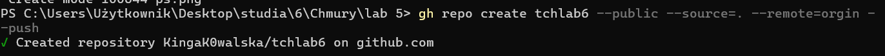
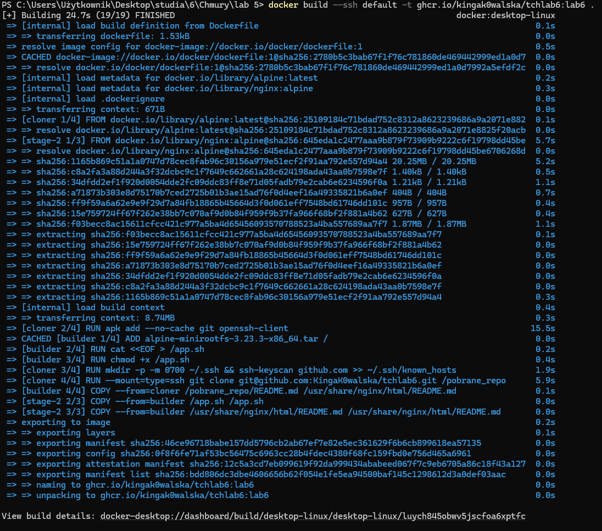
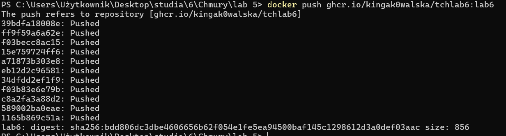
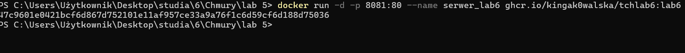
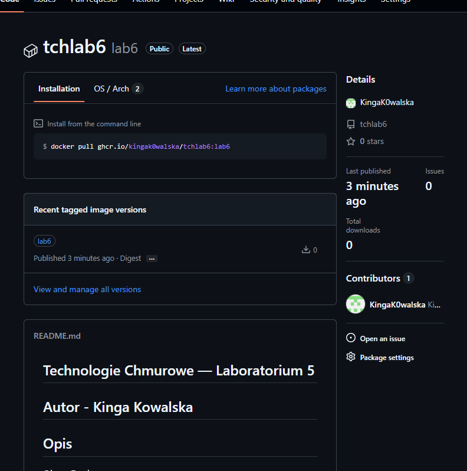
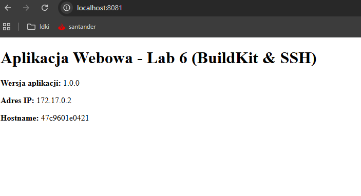
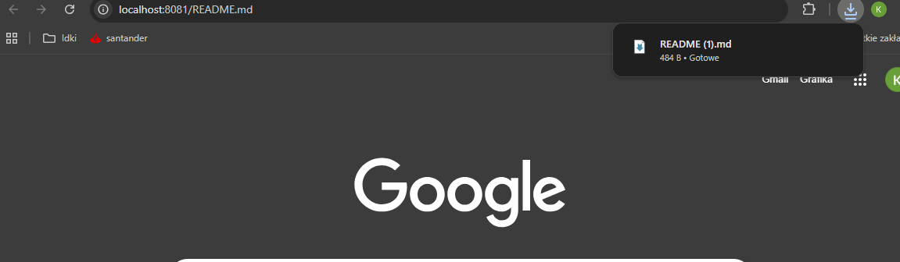

## Technologie Chmurowe — Laboratorium 6

## Autor - Kinga Kowalska

## Opis 
Utworzono repozytorium Github przy wykorzystaniu klienta CLI powiązane z katalogiem z lab5. Plik Dockerfile został zmodyfikowany. Wykorzystuje on rozszerzony frontend BuildKit oraz bezpieczne montowanie kluczy SSH, aby w wieloetapowym procesie budowania automatycznie pobrać zawartość repozytorium z GitHub i dołączyć ją do finalnego obrazu serwera Nginx.

## Utworzenie repozytorium

## Budowa obrazu 
obraz został zbudowany przy pomocy usługi ssh-agent i klucza SSH
polecenie:
docker build --ssh default -t ghcr.io/kingak0walska/tchlab6:lab6 .

## Uruchomienie serwera

## Zmiana atrybutu dostępu oraz powiązanie repozytorium

## Poprawne funkcjonowanie opracowanej aplikacji

