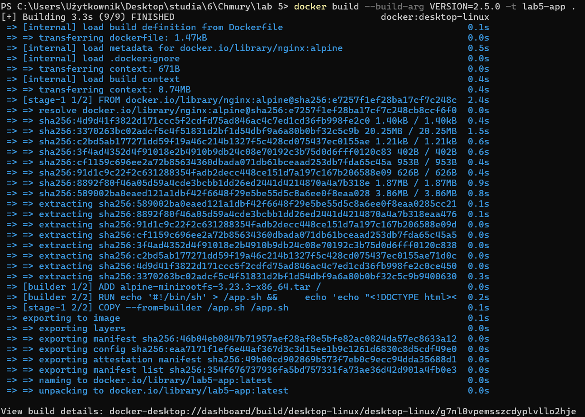
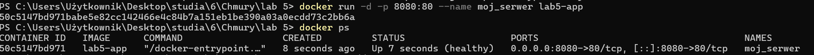
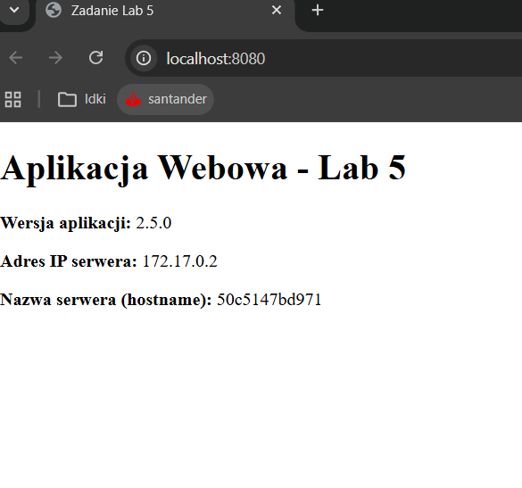

## Technologie Chmurowe — Laboratorium 5

## Autor - Kinga Kowalska

## Opis 
Obraz Docker

## Budowa obrazu 
docker build --build-arg VERSION=2.5.0 -t lab5-app .

## Uruchomienie serwera
docker run -d -p 8080:80 --name moj_serwer lab5-app

##  Polecenie potwierdzające działanie kontenera i poprawne funkcjonowanie opracowanej aplikacji
docker ps

